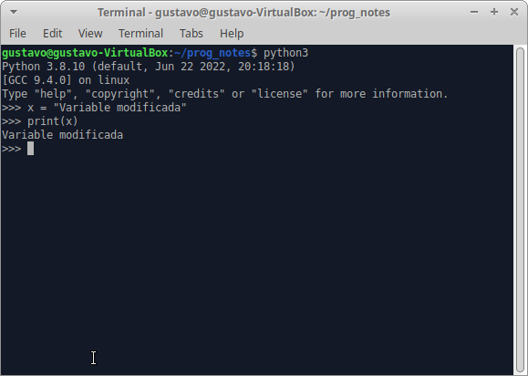

# Ejercicio 2

**Enunciado del ejercicio:**

Modifica la variable del anterior ejercicio en la consola de python y después muestrala por consola para ver la modificación de la variable.

**Solution**:

