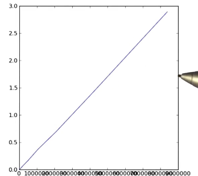

# Case Study

Math is really useful when writing an algorithm. They can help with:

1. Formalize what you are doing
2. Analize correctness
3. Analize efficiency

Efficiency standards are based on a particular variable or specification, it could be time, memory allocation, or electrical power efficiency.

**Example**

```py
def naive(a, b):
  x = a; y = b
  z = 0
  while x > 0:
    z += y
    x -= 1
  return z
```

What that code does?

A. Does it takes `max(a, b)`?

B. Does it calculates `a - b`?

C. Does it calculates `b - a`?

D. Does it calculates `a + b`?

E. Does it calculates `a * b`?

The answer is E, because `Y` is added, as many times as `X`

## Correctness of naive(a, b) = ab

*claim: Before or after "while" loop,*
$$
ab = xy + z
$$

**Proof**

*In Base Case: First Time Through,*

$$
x = a, y = b, z = 0
$$

*Based in claim:*

$$
ab = ab + 0
$$

*Inductive step*

If $ab = xy + z$, before, then $ab = x'y' + z'$ after

That holds for the entire loop, beacuse $x' = x - 1, y' = y, z' = z + y$ So it must follow that
$$x'y' + z' = (x -1)(y) + (z + y)$$ 
$$= xy - y + z + y$$ 
$$= xy + z$$

Given that the loop goes while $x > 0$ that means that when $x = 0$ the loop will terminate, so $$ xy + z = ab$$
$$0y + z$$
$$z + ab$$

## Running time of naive(a,b)

The larger the inputs, the longer the execution time.

If you make a graph, which plots the computational time, against the number being calculated, the graph will look like this:



The x-axis represents numbers in the order of billions, and the y-axis is time in seconds.

How does running time `t` relate to input `n`?

A. Roughly constant $t \approx c$

B. Roughly logarithmic $t \approx log(n)$

C. Roughly linear $t \approx cn$

D. Roughly exponential $t \approx c^n$

The answer is C.